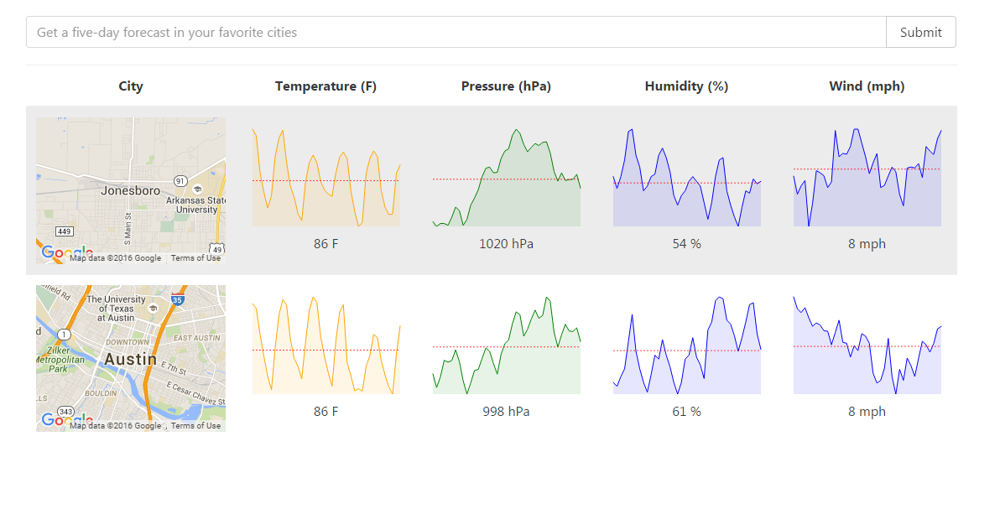

# React/Redux Weather App Demo

Demo project created from Udemy course Modern React with Redux by Stephen Grider

* Uses Open Weather Map API  (http://openweathermap.org/forecast5)
* Uses react-google-maps for adding Google Maps
* Uses Axiom for Ajax calls
* Uses react-sparklines for adding spark line charts

